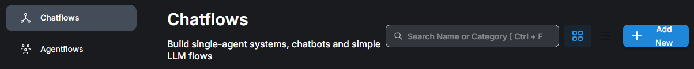
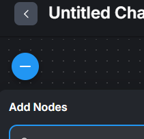

# Flowise AI 初學者指南（入門教學）

## 什麼是 Flowise？

Flowise 是一套開源的可視化 AI 工作流程平台，使用 **拖放式節點（node）** 搭建工作流程，每個節點代表一個功能（如提示模板、LLM 調用、工具或自定義程式）。你可以將節點連接起來，資料便會在節點間按順序流動，形成一個完整的 AI 代理工作流程。根據官方說明，Flowise 讓使用者不需要深入程式知識，就能透過連接 LLM 節點、功能節點等來構建 AI 代理。

Flowise 目前提供三種主要的可視化建置器：

| 模式                | 適合用途             | 說明                                                                       |
| ------------------- | -------------------- | -------------------------------------------------------------------------- |
| **Assistant** | 初學者、簡易助理     | 內建對話記憶與 RAG 功能，可快速建立單一助理。                              |
| **Chatflow**  | 單一代理工作流程     | 建立較靈活的聊天流程，能使用進階節點（如檔案載入、向量儲存、工具調用等）。 |
| **Agentflow** | 複合或多代理工作流程 | 能建立複雜的代理結構（循序代理、多代理協作等）。                           |

Flowise 具備的可視化優勢如下：

* **拖放式節點** ：直接拖拉節點建立代理、工具及檢索流程。
* **快速原型到生產** ：可先從簡單的流程出發，再逐步加入向量庫、外部工具、記憶機制等。
* **支援多種 LLM/資料庫** ：整合 OpenAI、Azure OpenAI、Anthropic、本地模型以及 Pinecone、Chroma、Postgres 等各種向量資料庫。

## 建立簡單 Chatflow 的步驟

以下示範如何從零開始建立一個簡易的問答助手。您可以根據需要改用「Assistant」介面，但 Chatflow 能學會大部分 Flowise 概念。

### 1 註冊或登入 Flowise

1. 若使用雲端版，可前往 [Flowise Cloud](https://cloud.flowiseai.com/) 註冊帳號並登入。若您已在本地安裝並啟動 Flowise，直接進入瀏覽器中的 `http://localhost:3000` 或您自訂的 IP 位址。
2. 登入後會看到左側的功能選單： **Chatflows、Agentflows、Executions、Assistants、Marketplace、Tools、Credentials、Variables 等** 。

### 2 新增 Chatflow

1. 在左側選單點選  **Chatflows** 。官方文件提到登入後前往「Chatflows」並點擊 **Add New** 即可建立新的工作流程。
   
2. 進入畫布後，右上角會出現 **Add Node** 或左下角有節點工具箱，可選擇要放置的節點。
   

### 3 加入基本節點

要建立最簡單的問答聊天機器人，主要需要三個節點：

1. **Chat Input** （或訊息輸入） – 接收使用者輸入。
2. **Prompt Template** – 用來撰寫提示文本，引導 LLM 回答。以最簡單形式，可以直接透過「Prompt Template」節點將 `{{question}}` 傳遞給模型。範例提示：
   ```
   你是一個友善的助理，用繁體中文回答問題。問題：{{question}}
   ```
3. **LLM** 節點 – 指定要調用的模型（例如 OpenAI GPT‑3.5 或 GPT‑4）。若使用 OpenAI，需在「Credentials」中新增 API 金鑰，或於模型節點中填入 API Key。

將這三個節點依序連接：`Chat Input → Prompt Template → LLM`。若有回應節點可以直接連到輸出；不加回應節點則預設 LLM 輸出即為回應。


### 4 設定模型及提示

* 在 **Prompt Template** 節點中輸入提示，並於「Format Prompt Values」裡設定參數名稱，例如 `question` 對應到 `Chat Input` 的輸出。這是 Flowise 常見的值插入方式。官方教學指出，可以透過 `Format Prompt Values` 將前一節點的輸出指派給提示中的變數。
* 在 **LLM** 節點選擇模型並填入 API 金鑰。若使用 OpenAI，需要在 Flowise 的 **Credentials** 頁面建立 OpenAI 憑證，然後在模型節點選擇該憑證。

### 5 測試與分享

1. 點擊畫布右上方的 **Save** 或  **Deploy** 。
2. 你可以在編輯器右側的 **Chat** 視窗直接輸入問題來測試。若一切正常，模型會依據提示回答。
3. 若想將此聊天機器人嵌入網站或分享給他人，可以在 Chatflow 列表中點選該流程，利用分享連結或嵌入碼。雲端版提供內嵌聊天小工具。

## 使用變數（Variables）

Flowise 支援在不同節點之間共享資料。你可以在左側選單中選擇 **Variables** 新增變數。文件指出，變數可分為 **靜態 (Static)** 與  **運行時 (Runtime)** 。

* **靜態變數 (Static)** ：在建立時指定固定值，節點調用時會直接取用。
* **運行時變數 (Runtime)** ：變數值從 `.env` 檔案或環境變數讀取，適合存放 API 金鑰或機密設定。

建立變數後，可以透過下列方式在節點中取用：

* 在自訂程式或工具節點的程式碼裡使用 `$vars.<變數名稱>`。
* 在任何文字輸入框（例如提示模板）使用 `{{$vars.<變數名稱>}}`。

舉例：如果建立了一個名為 `character` 的變數，值為「智慧助理」，則可以在提示中寫：

```
你扮演 {{$vars.character}}，請用繁體中文回答我的問題：{{question}}
```

這樣每次執行時，`{{$vars.character}}` 會被替換為「智慧助理」。

> **注意** ：若要讓 API 端覆寫變數值，需要在「Settings → Configuration → Security」頁籤中啟用變數覆寫權限。

## 進一步學習建議

* **官方教學影片與文檔** ：Flowise 團隊提供了完整的 V3 更新教學、Sequential Agents 等進階指南，可從官方文件中的「Video Tutorials」入口瀏覽。學習路線可以從簡單聊天流程逐漸延伸到 RAG（檢索增強生成）和多代理系統。
* **Sider 教學整理** ：2025 年整理的教學資源指出，Flowise 支援快速原型、可與各種 LLM 及向量資料庫整合，建議先完成簡單聊天機器人，熟悉節點的輸入與輸出，再進一步加入文件載入器、分段器和向量庫建構 RAG 機器人。
* **實驗與分享** ：Flowise 允許匯入和匯出 JSON 格式的流程。建議您在本地建立數個小型流程互相連接，例如：

1. 基本問答流程。
2. 加入 **Document Loader + Splitter + Embeddings + Vector Store** 節點，使機器人能閱讀文件。
3. 使用 **Tool Agent** 節點整合搜尋引擎、計算器等工具，建立多功能代理。

以上步驟將幫助您從最基礎開始熟悉 Flowise，逐步拓展到更複雜的 AI 代理應用。

---
